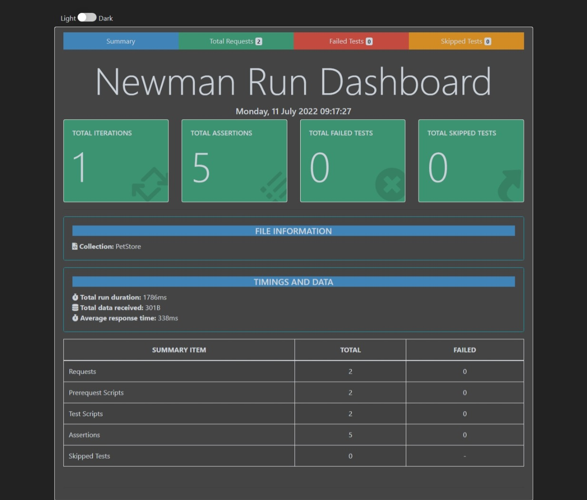

# Postman Newman Test for Swagger Petstore

## How to execute the newman tests?

You have to have newman installed:
`npm install -g newman`

A reported for newman is optional but convenient:
`npm install -S newman-reporter-htmlextra`

Then you can run the tests:
`newman run mycollection.json`

Or run with the option to create a report:
`newman run mycollection.json -r htmlextra`

This is an example of what the report looks like:

## Resources

* Postman
* Newman
* Swagger Petstore Api